# Welcome to the Immovable Hutting repository!

This project is an ApiRest that integrates a property search system, with its ads and reservations.

<details>
  <summary><strong>🤷 What was used?</strong></summary><br />

  <strong>Technologies and Skills</strong><br />
  ~ Python<br />
  ~ Django<br />
  ~ ORM(Django Rest Framework)<br />
  ~ SQL Data Base(sqlite3)<br />
  ~ Pytest<br />
  ~ Black<br />
  ~ Flake8<br />
  ~ Seeders(fixture)<br />
</details><br />

<summary><strong>👨‍💻 How it works ?</strong></summary><br />

The application has three APIs, one for Immobles, one for Annoucements and the other for Reserves.

<strong>-> Application APIs</strong> 

- **Immoble**<br />
-present in path 'immovablehutting/models';<br />
-can interact with all http methods;<br />

- **Annoucement**<br />
-present in path 'immovablehutting/models';<br />
-does not interact only with the delete http method;<br />

- **Reserve**<br />
-present in path 'immovablehutting/models';<br />
-does not interact only with update http methods;<br /><br />

# Guidelines<br />

ATTENTION: make sure you have python installed on your machine and stay tuned with the version.<br />


<summary><strong>Get ready and follow the steps</strong></summary><br />

  ~ create a directory on your machine and access it with the terminal:
  ```bash
    $ mkdir example_directory && cd example_directory
  ```  
  ~ create and access the virtual environment:
  ```bash
    $ python3 -m venv .venv && source .venv/bin/activate
  ```
  ~ install the dependencies:<br />
  ```bash
    $ python3 -m pip install -r requirements.txt
  ```
  ~ now start the API:<br />
  ```bash
    $ python3 manage.py runserver
  ```  
<br /><br />

# Tests<br />

-The APIs have unit tests implemented by the 'pytest' library present in the 'tests' directory where each test checks the existence and creation of each application's API.


<summary><strong></strong></summary><br />

~ o run the tests, run the following command in your terminal:<br />
 ```bash
  $ python3 -m pytest
```

<br /><br />

# Consuming the API<br />

-After starting the application, your cmd will look like the one in the image below, where it indicates a port to be accessed (eg: 'http://127.0.0.1:8000/').
It is through her that we will carry out the requests.<br />
-Requests will be made from the `/api` route. ex.: http://127.0.0.1:8000/api/ .<br />
-If you don't have a client (such as 'Insomnia, Postman' or any other) installed on your machine, you can carry out the requests through your browser by placing the mouse cursor over the route and pressing 'Ctrl + click' .<br />
-The APIs always returned <strong>Json</strong><br />
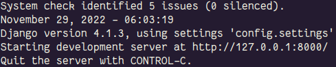<br />

### 🕵 Sample requests will be implemented with the Postman client. <br />

## Routes<br />
 `/api`:<br />
  - `http://127.0.0.1:8000/api/`<br />
  -This route generates the application's API routes through the GET method.<br /><br />
  <br />
  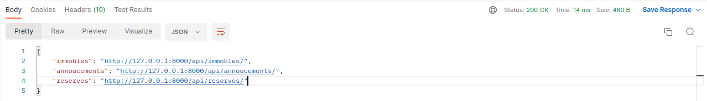<br /><br /><br />


 `/immobles`:<br />
  - `http://127.0.0.1:8000/api/immobles/`<br />
  -This route interacts with the HTTP methods of a CRUD.<br />
  <br />
  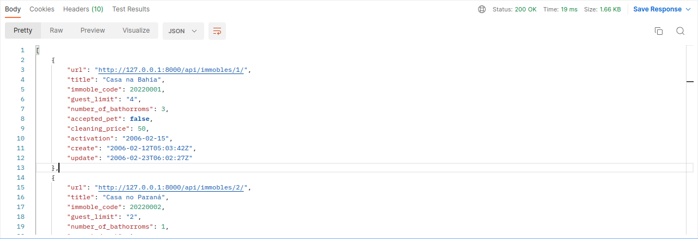<br />
  -For the Post, Put or Patch methods, use the following scope in the client's body:<br />
  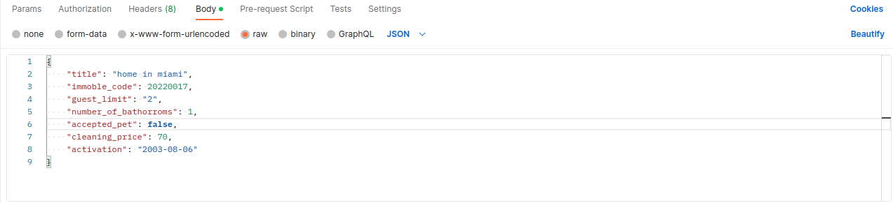<br />

```python
  {
    "title": "Home in Miami",
    "immoble_code": 20220017,
    "guest_limit": "2",
    "number_of_bathorroms": 1,
    "accepted_pet": false,
    "cleaning_price": 70,
    "activation": "2006-02-15",
  }
```
  <br />

  -Select the update method and make the request:<br />
  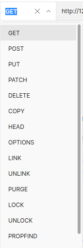<br />
  -A immoble can be searched for or edited by the route that receives its 'id':
  - `http://127.0.0.1:8000/api/immobles/3`<br />
  <br />
  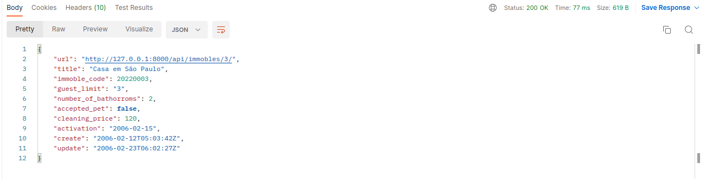<br />
  <br /><br />

 `/announcements`:<br />
  - `http://127.0.0.1:8000/api/annoucements/`<br />
  -This route works with the same principles as immobles with restrictions only on the DELETE method.<br /><br />
  <br />
  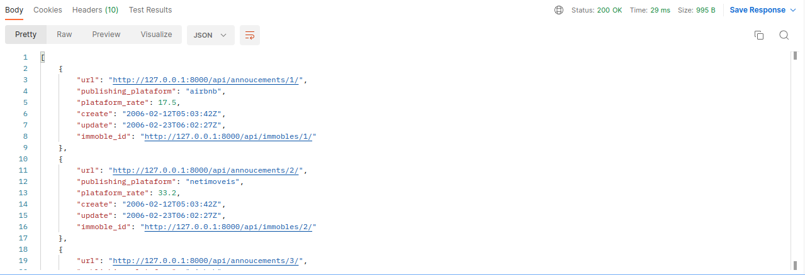<br /> <br />

  -Its search method for just one ad is similar to that of real estate, passing the 'id' at the end of the url:<br /><br />
  <br />
  <br /> <br />

  -To use the update methods, pass the url with the 'id' of the ad and set the json model in the body with the data you want to change:<br />

  ```python
  {
    "publishing_plataform": "airbnb",
    "plataform_rate": 22.7,
  }
  ```
- `http://127.0.0.1:8000/api/annoucements/1/`<br />
  <br />
  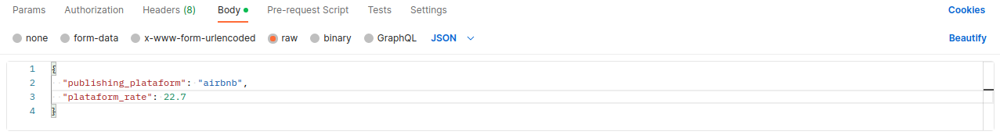<br />
  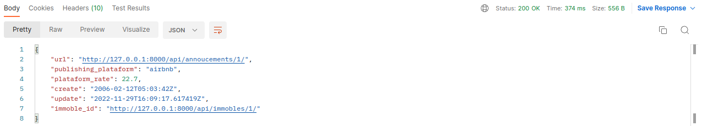<br /><br /><br />


 `/reserves`:<br />
  - `http://127.0.0.1:8000/api/reserves/`<br />
  -This route works on the same principles as real estate and listings with restrictions only on update methods.<br /><br />
  <br />
  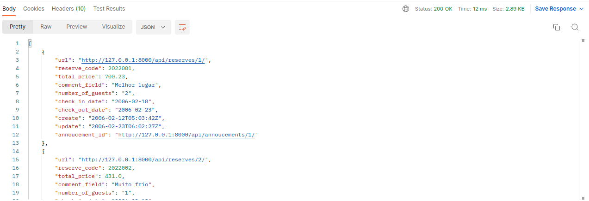<br /> <br />

  -Its search method for just one reserve is similar to that of immoble and announcements, passing the 'id' at the end of the url:<br />
- `http://127.0.0.1:8000/api/reserves/3/`
  <br />
  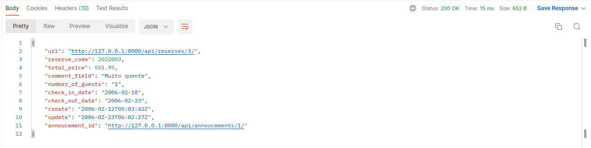<br /> <br />
